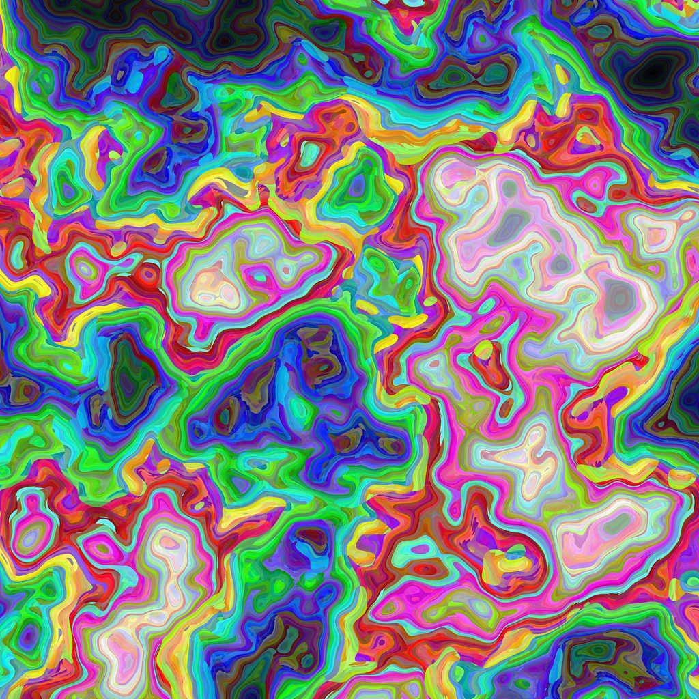

# allrgb - Use every 24b colour value for exactly one pixel.

A copy of sino (SimplexNoise) is included.

A copy of stb_image_write.h is included.

The original output:

This one has the Hue/Sat/Val fields normalized before generating the RGB values:

Here is a video of me, doing the live coding session, writing this code:

https://youtu.be/DwJgD4A3AOw 

